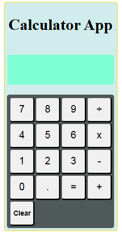
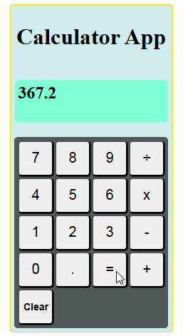

# Interactive Greeting App


## 📋 Description

A working calculator that performs basic arithmetic operations (add, subtract, multiply, divide). Users click number buttons, operation buttons, and get results displayed in real-time.

**Live Demo:** [View Live](https://alig487.github.io/js-project-02-simpleCalculator)

## ✨ Features

- ✅ Numeric and operation buttons
- ✅ Display screen
- ✅ Quick operation
- ✅ Easy and minimal code
- ✅ Clear button functionality

## 🎯 Technologies Used

- **HTML5** - Page structure
- **CSS3** - Styling
- **Vanilla JavaScript** - DOM manipulation and logic

## 📸 Screenshots




## 🚀 Quick Start

```bash
# Clone the repository
git clone https://github.com/AliG487/js-project-02-simpleCalculator

# Navigate to project folder
cd js-project-02-simpleCalculator

# Open in browser
# Method 1: Direct open
open index.html

# Method 2: Using Python server
python -m http.server 8000
# Visit http://localhost:8000

# Method 3: VS Code Live Server
# Right-click index.html → Open with Live Server
```

## 📖 How to Use

1. Open the application in your browser
2. Enter numbers and desired operation using UI buttons
3. Click "=" or press Enter
4. See your result!
5. Click "Clear" to clear result

## 🎓 Key Concepts Learned

- **DOM Manipulation** - How to select HTML elements and modify their content
- **Event Listeners** - Handling click and keypress events
- **eval Method** - Evaluating the user input data
- **Keyboard Events** - Capturing keydown event for "Enter" key

## 🔄 Challenges Faced

### Challenge: Implementing "Enter" key functionality

```javascript
function keyBoardInput() {
  window.addEventListener("keydown", (e) => {
    e.preventDefault()
    if (e.key === "Enter") {
      display.innerText = parseFloat(eval(expression).toFixed(2))
      expression = ""
    }
  })
}
```

### Challenge: Evaluating user entered data and clearing it afterwards

```javascript
function calculate() {
  if (expression) {
    let result = eval(expression)
    //round off result to 2 decimal places
    display.innerText = parseFloat(result.toFixed(2))
    expression = ""
  }
}
```

## 📚 Files Explained

- `index.html` - HTML structure with input field and greeting display
- `style.css` - Styling with gradient background
- `script.js` - JavaScript logic for greeting functionality

## ✅ Features Breakdown

| Feature                   | Implementation                                 |
| ------------------------- | ---------------------------------------------- |
| Input handling            | `querySelector()` and `value` property         |
| Evaluating expression     | `eval()` method                                |
| Capturing keyboard events | on `keydown` event capture `e.key === "Enter"` |
| Clear input               | Set `value = ''` after evaluation              |

## 🔮 Future Improvements

1. **Keyboard input support** - enter numbers, oprators and other data from keyboard
2. **Delete last digit** - Add functionality to delete last digit using UI and keyboard
3. **Recall** - Add functinality to rcall last operation

## 🎯 Learning Outcomes

This project helped me understand:

- ✅ How to implement arithmatic opertions
- ✅ How event listeners on multiple elements work
- ✅ How to build conditional logic
- ✅ How to store values in variables
- ✅ How to display updates

## 📝 License

MIT License - Feel free to use this project!

## 👨‍💻 Author

**Gohar Ali**

- GitHub: [@AliG487](https://github.com/AliG487)
- Email: engr.ali487@gmail.com

---

Made with ❤️ by Gohar Ali
